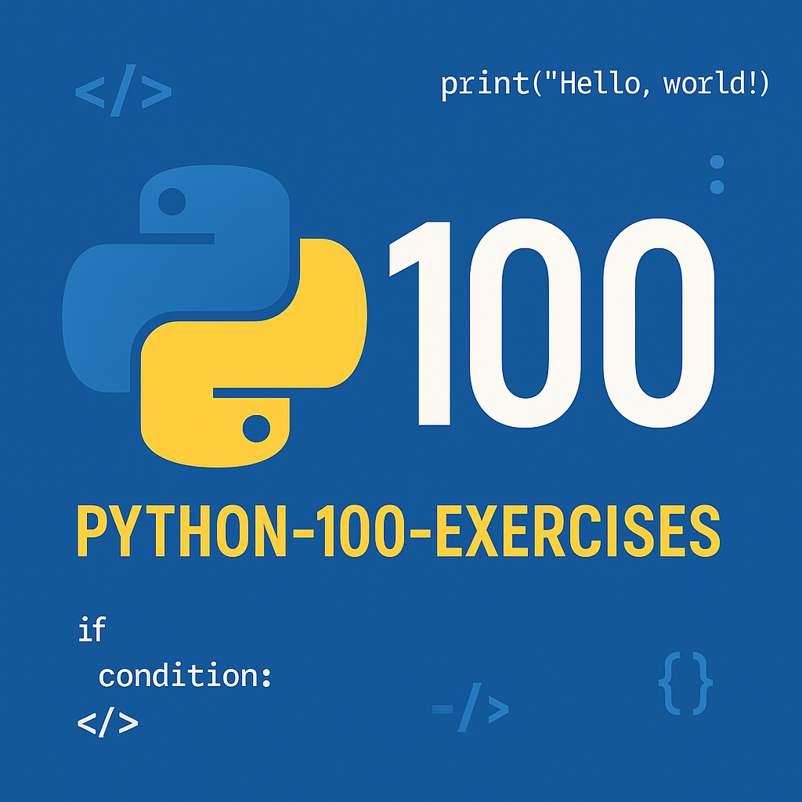

<p align="center">
  
</p>
<h1 align="center">Python-100-Exercises</h1>

<p align="center">
  一个结构化、可执行、可测试的 Python 100 题实战项目。
</p>

---

## 💡 项目由来

笔者对 AI 行业充满热情，并深感 Python 是该领域不可或缺的基石。在学习时，我发现"纸上得来终觉浅"，只有在实践中不断试错、解决问题，才能真正掌握知识。

为了能有一个系统性的、可检验的学习路径，这个项目应运而生。它旨在将经典的"Python 100 例"升级为一个现代化的、交互式的实践平台，帮助学习者巩固基础，向初级开发工程师的目标迈进。

> **AI 协同开发**
> 值得一提的是，本项目的大部分代码、测试和文档是借助 **Gemini 2.5 Pro** 生成的。AI 辅助极大地提高了开发效率，但内容难免存在瑕疵或不合理之处，我们真诚地欢迎您通过 Issue 或 Pull Request 指出！

## ✨ 项目亮点

- **结构化**: 题目按知识点分门别类，存放于 `part_1` 到 `part_7` 的目录中。
- **可执行**: 每道题都有一个可独立运行的 `exercise_NNN.py` 文件。
- **可测试**: 配备了基于 `pytest` 的单元测试 (`test_exercise_NNN.py`)，即时验证代码的正确性。
- **现代化**: 代码遵循现代 Python 风格，包含类型提示和详细的文档字符串。

完整的 100 道题目清单，请参见 **[题目清单.md](题目清单.md)**。

## 🚀 快速开始

我们强烈推荐使用 Python 虚拟环境来保证依赖的纯净。

1.  **克隆项目**

    ```bash
    git clone https://github.com/bosens-China/Python-100-Exercises.git
    cd Python-100-Exercises
    ```

2.  **创建并激活虚拟环境**

    ```bash
    # 创建一个名为 .venv 的虚拟环境
    python -m venv .venv
    ```

    - **Windows (PowerShell):**
      ```powershell
      .venv\Scripts\Activate.ps1
      ```
      _若遇执行策略问题，请以管理员身份运行 PowerShell 执行 `Set-ExecutionPolicy Unrestricted -Scope Process`_
    - **macOS / Linux:**
      ```bash
      source .venv/bin/activate
      ```
      _激活成功后，终端提示符前会出现 `(.venv)_

3.  **安装依赖**

    ```bash
    pip install -r requirements.txt
    ```

4.  **运行所有测试**
    这是检验项目是否正确配置，以及所有练习是否都已正确完成的最佳方式。

    ```bash
    pytest -v
    ```

5.  **启动实时测试 (推荐)**
    使用 `pytest-watch` 自动监控文件改动并运行测试，这是最高效的学习和开发方式。
    ```bash
    ptw . -- -v
    ```

## 📂 项目结构

项目严格按照知识领域划分为七个部分：

```
.
├── part_1_basics/            # 基础语法和数据类型 (1-20)
├── part_2_control_flow/      # 控制流 (21-40)
├── part_3_functions/         # 函数 (41-60)
├── part_4_oop/               # 面向对象编程 (61-75)
├── part_5_files_exceptions/  # 文件和异常处理 (76-85)
├── part_6_standard_library/  # 标准库和常用模块 (86-95)
└── part_7_projects/          # 实战项目 (96-100)
```

> ### 关于部分练习缺少测试的说明
>
> 少数交互式或以生成文件为目的的练习（如 `exercise_090.py` `sys`模块、`exercise_099.py` 贪吃蛇游戏）未提供单元测试，我们鼓励您直接运行 `python a_script.py` 来体验和学习。

## 🏃 运行单个练习

您可以直接运行任何一个练习文件来查看其效果：

```bash
# 运行第3题：计算圆的面积
python part_1_basics/exercise_003.py
```

## 🤝 贡献

欢迎任何形式的贡献！无论是修正 bug、提供更优解法，还是改进测试，都请随时提出 Issue 或提交 Pull Request。

## 📜 许可

本项目采用 [MIT 许可](LICENSE)。
